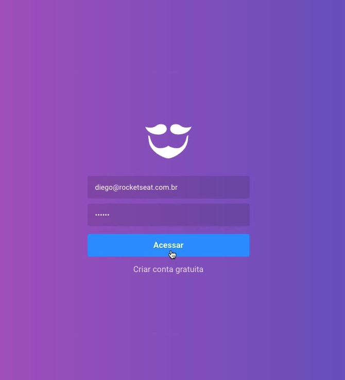

# Estilização da autenticação

Assim será a página SignIn:


O estilo de SignIn e SignUp eu não vou criar na pasta pages, e sim dentro do
layout `auth`, isto pq são páginas tão parecidas, q são estilos comuns às 2
pages.

## src/pages/SignIn/index.js

```diff
import React from 'react';
+import { Link } from 'react-router-dom';

+import logo from '~/assets/logo.svg';

-// import { Container } from './styles';

function SignIn() {
-  return <h1>SignIn</h1>;
+  return (
+    <>
+      
+
+      <form>
+        <input type="email" placeholder="Seu e-mail" />
+        <input type="password" placeholder="Sua senha secreta" />
+
+        <button type="submit">Acessar</button>
+        <Link to="/register">Criar conta gratuita</Link>
+      </form>
+    </>
+  );
}

export default SignIn;
```

## src/pages/SignUp/index.js

SignUp está praticamente idêntico a SignIn.

```diff
import React from 'react';
+import { Link } from 'react-router-dom';
+
+import logo from '~/assets/logo.svg';

-// import { Container } from './styles';

function SignUp() {
-  return <h1>SignUp</h1>;
+  return (
+    <>
+      
+
+      <form>
+        <input placeholder="Nome Completo" />
+        <input type="email" placeholder="Seu e-mail" />
+        <input type="password" placeholder="Sua senha secreta" />
+
+        <button type="submit">Criar conta</button>
+        <Link to="/">Já tenho login</Link>
+      </form>
+    </>
+  );
}

export default SignUp;
```

## src/pages/\_layouts/auth/index.js

```diff
import React from 'react';
import PropTypes from 'prop-types';

-import { Wrapper } from './styles';
+import { Wrapper, Content } from './styles';

export default function AuthLayout({ children }) {
-  return <Wrapper>{children}</Wrapper>;
+  return (
+    <Wrapper>
+      <Content>{children}</Content>
+    </Wrapper>
+  );
}

AuthLayout.propTypes = {
  children: PropTypes.element.isRequired,
};
```

## src/pages/\_layouts/auth/styles.js

```diff
import styled from 'styled-components';
+import { darken } from 'polished';

export const Wrapper = styled.div`
  height: 100%;
  background: linear-gradient(-90deg, #7159c1, #ab59c1);
+ display: flex;
+ justify-content: center;
+ align-items: center;
`;

+export const Content = styled.div`
+ width: 100%;
+ max-width: 315px;
+ text-align: center;
+ form {
+   display: flex;
+   flex-direction: column;
+   margin-top: 30px;
+   input {
+     background: rgba(0, 0, 0, 0.1);
+     border: 0;
+     border-radius: 4px;
+     height: 44px;
+     padding: 0 15px;
+     color: #fff;
+     margin: 0 0 10px;
+     &::placeholder {
+       color: rgba(255, 255, 255, 0.7);
+     }
+   }
+   button {
+     margin: 5px 0 0;
+     height: 44px;
+     background: #3b9eff;
+     font-weight: bold;
+     color: #fff;
+     border: 0;
+     border-radius: 4px;
+     font-size: 16px;
+     transition: backgroundd 0.2s;
+     &:hover {
+        background: ${darken(0.03, '#3b9eff')};
+      }
+    }
+
+    a {
+      color: #fff;
+      margin-top: 15px;
+      font-size: 16px;
+      opacity: 0.8;
+
+      &:hover {
+        opacity: 1;
+      }
+    }
+  }
+`;
```
